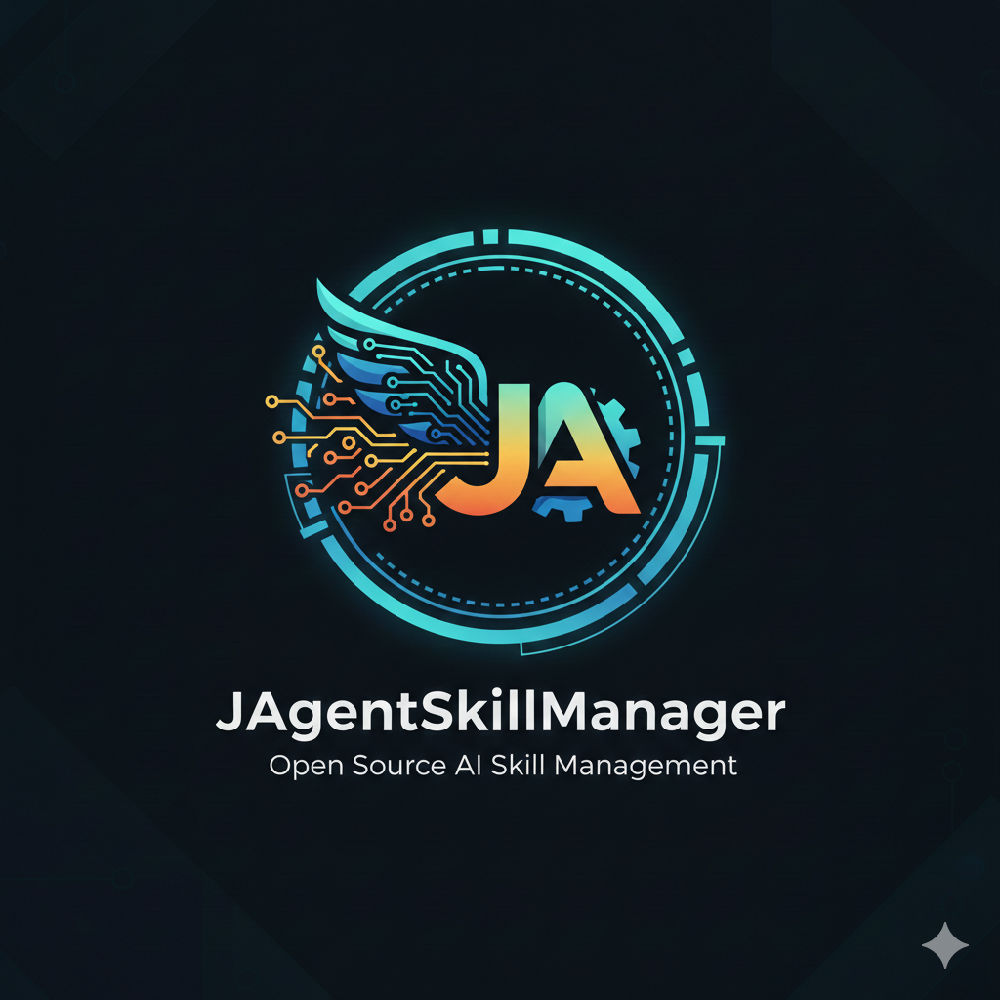

# Agent Skill Manager Framework

<p align="center">
  
</p>

一个用于 Spring AI 的 Agent Skill 管理框架，提供了灵活的方式来管理和集成各种技能到 Spring AI 应用中。支持传统 Spring Bean 技能和 agentskills.io 标准格式。

## 📚 文档与快速索引

语言： [中文](README.md) | [English](README_EN.md)

主要文档索引（更多详细文档请到 `docs/README.md`）：

- 文档目录： [docs/README.md](docs/README.md)
- API 参考： [docs/api/API_DOCUMENTATION.md](docs/api/API_DOCUMENTATION.md)
- 指南： [docs/guides/use/tool-integration.md](docs/guides/use/tool-integration.md)、[docs/guides/use/skill-prompt-integration.md](docs/guides/use/skill-prompt-integration.md)

若需浏览完整文档目录与分类，请打开 `docs/README.md` 阅读。

## 框架特性

- **多格式支持**: 同时支持 Spring Bean 技能和 agentskills.io 标准格式
- **模块化技能管理**: 通过统一的 `AgentSkill` 接口管理各种技能
- **Spring AI 集成**: 无缝集成到 Spring AI 框架，支持函数调用
- **自动配置**: 支持 Spring Boot 自动配置和属性配置
- **热重载**: 支持技能的热重载和动态加载/卸载
- **渐进式披露**: 按照 agentskills.io 规范实现高效的上下文管理
- **迁移工具**: 提供技能格式转换和迁移工具
- **事件监听**: 提供技能执行事件的监听机制
- **扩展性**: 易于添加新技能和自定义实现

## 核心组件

### 1. AgentSkill 接口
所有技能的基础接口，定义了技能的核心方法：
- `getName()`: 获取技能名称
- `getDescription()`: 获取技能描述
- `canHandle()`: 判断是否能处理特定请求
- `execute()`: 执行技能逻辑
- `getRequiredParameters()` / `getOptionalParameters()`: 定义参数
- `getInstructions()`: 获取 SKILL.md 指令内容（agentskills.io 格式）

### 2. SkillManager 接口及其实现
技能管理服务，负责：
- 注册和管理技能
- 查找合适的技能处理请求
- 执行技能并返回结果
- 提供事件监听机制

重构后的技能管理器采用策略模式，包括：
- `DefaultSkillManager`: 默认实现
- `SpringBeanSkillManager`: 专门管理 Spring Bean 技能
- `FolderBasedSkillManager`: 专门管理文件夹技能
- `UnifiedSkillManager`: 统一技能管理器

### 3. SpringAIAgentSkillAdapter
Spring AI 集成适配器，提供：
- 将 AgentSkill 转换为 Spring AI 函数
- 生成函数定义和参数 schema
- 获取所有指令内容用于系统提示增强

### 4. SkillLoader 接口及其实现
插件化技能加载器，支持：
- 从多种来源加载技能（文件夹、JAR、Spring Bean 等）
- 支持多种技能格式
- 安全的动态类加载

重构后的加载器架构包括：
- `SkillLoader`: 加载器接口
- `SkillLoaderRegistry`: 加载器注册表
- `FolderSkillLoader`: 文件夹技能加载器
- `SpringBeanSkillLoader`: Spring Bean 技能加载器

### 5. agentskills.io 支持

#### SkillMarkdownParser
- 解析 SKILL.md 文件中的 YAML Frontmatter
- 提取元数据和指令内容
- 验证名称和描述格式

#### SkillDescriptor (增强版)
- 支持 agentskills.io 规范的所有字段
- 兼容传统的 skill.json/yaml 格式
- 验证技能名称格式（小写字母、数字、连字符）

#### AgentSkillManager (agentskills.io 专用)
- 技能验证和元数据管理
- 按关键词搜索技能
- 生成技能文档

### 6. SkillLifecycleManager
技能生命周期管理，提供：
- 动态加载/卸载技能
- 文件监控和热重载
- 批量技能操作

### 7. 事件驱动架构
重构后引入了事件驱动架构，包括：
- `SkillLoadedEvent`: 技能加载事件
- `SkillUnloadedEvent`: 技能卸载事件
- `SkillExecutedEvent`: 技能执行事件
- `SkillEventManager`: 事件发布器

### 8. 安全增强
重构后增强了安全性，包括：
- `SecureClassLoader`: 安全的类加载器
- `InputValidationUtils`: 输入验证工具
- 路径遍历防护机制

### 9. 缓存机制
重构后引入了缓存机制，包括：
- `SimpleCache`: 通用缓存实现
- `SkillCacheManager`: 技能缓存管理器
- 元数据和执行结果缓存

### 10. 配置组件
- `AgentSkillAutoConfiguration`: 自动配置类
- `AgentSkillProperties`: 配置属性（带验证）
- `ConfigurationValidator`: 配置验证器

### 11. 迁移工具
- `SkillMigrationUtils`: 技能格式转换
- 从 Spring Bean 迁移到文件夹格式
- 生成技能模板和结构

## 支持的技能格式

### 传统 Spring Bean 技能
```java
@Component
public class MySkill implements AgentSkill {
    @Override
    public String getName() { return "my-skill"; }
    // ... 其他方法实现
}
```

### agentskills.io 标准格式
```
skill-name/
├── SKILL.md          # 必需：包含 YAML Frontmatter 和 Markdown 指令
├── scripts/          # 可选：可执行脚本
├── references/       # 可选：文档和参考资料
└── assets/           # 可选：模板、图片等资源
```

#### SKILL.md 示例结构
```yaml
---
name: pdf-processing
description: 从 PDF 文件中提取文本和表格...
license: Apache-2.0
metadata:
  author: agent-skill-team
  version: "1.0"
---

# PDF 处理技能

## 何时使用此技能
使用此技能当...

## 如何提取文本
1. **输入**: 提供 PDF 文件路径...
```

## 使用方法

### 1. 依赖说明（已更新）

该项目已移除对 Spring AI 的直接依赖，保留用于运行与解析技能描述的必要依赖。下面是推荐的核心依赖示例 — 请以项目 `pom.xml` 中声明的版本为准：

```xml
<!-- JSON/YAML parsing -->
<dependency>
  <groupId>com.fasterxml.jackson.core</groupId>
  <artifactId>jackson-databind</artifactId>
  <version>2.15.2</version>
</dependency>
<dependency>
  <groupId>com.fasterxml.jackson.dataformat</groupId>
  <artifactId>jackson-dataformat-yaml</artifactId>
  <version>2.15.2</version>
</dependency>

<!-- Logging (Logback) -->
<dependency>
  <groupId>ch.qos.logback</groupId>
  <artifactId>logback-classic</artifactId>
  <version>1.4.11</version>
</dependency>

<!-- 其余依赖请在 pom.xml 中查看 -->
```

### 2. 配置属性

在 `application.yml` 中配置：

```yaml
agent:
  skill:
    enabled: true
    auto-register: true
    spring-ai-integration: true
    
    # 文件夹技能支持
    folder-based-skills: true
    skills-directory: "skills"
    hot-reload-enabled: true
    auto-load-skills: true
    
    # agentskills.io 支持
    agentskills-enabled: true
    strict-validation: true
    progressive-disclosure: true
    max-skill-md-size-kb: 50
```

### 3. 创建技能

#### Spring Bean 技能
```java
@Component
public class MyCustomSkill implements AgentSkill {
    
    @Override
    public String getName() {
        return "my-custom-skill";
    }
    
    @Override
    public String getDescription() {
        return "Custom skill for specific task";
    }
    
    @Override
    public boolean canHandle(String request) {
        return request.toLowerCase().contains("my task");
    }
    
    @Override
    public AgentSkillResult execute(String request, Map<String, Object> parameters) {
        // 实现技能逻辑
        return AgentSkillResult.success()
                .message("Task completed successfully")
                .data(result)
                .skillName(getName())
                .build();
    }
    
    // 其他方法...
}
```

#### agentskills.io 技能
创建 `skills/my-skill/SKILL.md`：

```yaml
---
name: my-skill
description: 针对特定任务处理的自定义技能
license: MIT
metadata:
  author: your-name
  version: "1.0"
---

# 我的自定义技能

## 何时使用此技能
当你需要...时使用此技能

## 如何处理请求
1. **步骤一**: 第一个处理步骤
2. **步骤二**: 第二个处理步骤

### 参数
- `input_data` (必需): 要处理的数据
- `mode` (可选): 处理模式 - "fast" 或 "thorough"

## 脚本参考

### `scripts/processor.py`
主要处理脚本包含...

## 错误处理

常见错误及解决方案...
```

### 4. 使用技能管理器

```java
@Service
public class MyService {
    
    @Autowired
    private AgentSkillManager skillManager;
    
    public void processRequest(String request) {
        // 自动查找合适的技能
        AgentSkillResult result = skillManager.executeSkill(request, Map.of());
        
        if (result.isSuccess()) {
            // 处理成功结果
        } else {
            // 处理失败情况
        }
    }
}
```

### 5. Spring AI 集成

```java
@RestController
public class SkillController {
    
    @Autowired
    private SpringAIAgentSkillAdapter skillAdapter;
    
    public String getSystemInstructions() {
        // 获取所有技能的指令用于系统提示
        return skillAdapter.getAllInstructions();
    }
    
    public Object executeSkillFunction(String functionName, Map<String, Object> arguments) {
        // 执行技能函数
        return skillAdapter.executeFunction(functionName, arguments);
    }
}
```

## 项目结构

重构后的项目结构遵循领域驱动设计（DDD）：

```
src/main/java/org/unreal/agent/skill/
├── core/                           # 核心接口和基础实现
│   ├── AgentSkill.java             # 核心技能接口
│   ├── AgentSkillResult.java       # 技能执行结果
│   └── exception/                  # 核心异常类
│       ├── SkillException.java
│       ├── SkillExecutionException.java
│       └── SkillValidationException.java
├── manager/                        # 技能管理器
│   ├── SkillManager.java           # 技能管理接口
│   ├── DefaultSkillManager.java    # 默认实现
│   ├── SpringBeanSkillManager.java # Spring Bean 管理器
│   ├── FolderSkillManager.java     # 文件夹技能管理器
│   └── registry/                   # 管理器注册和选择
│       ├── SkillManagerRegistry.java
│       └── SkillManagerSelector.java
├── loader/                         # 技能加载器
│   ├── SkillLoader.java            # 加载器接口
│   ├── SkillLoaderRegistry.java    # 加载器注册表
│   ├── impl/                       # 具体加载器实现
│   │   ├── JarSkillLoader.java
│   │   ├── ScriptSkillLoader.java
│   │   ├── ClassSkillLoader.java
│   │   └── FolderBasedSkillLoader.java
│   └── model/                      # 加载相关模型
│       ├── LoadedSkill.java
│       └── LoadContext.java
├── validator/                      # 验证器
│   ├── SkillValidator.java         # 验证器接口
│   └── DefaultSkillValidator.java
├── lifecycle/                      # 生命周期管理
│   ├── SkillLifecycleManager.java
│   ├── SkillLifecycleListener.java
│   └── event/                      # 生命周期事件
│       ├── SkillLoadedEvent.java
│       ├── SkillUnloadedEvent.java
│       └── SkillReloadedEvent.java
├── cache/                          # 缓存相关
│   ├── SimpleCache.java
│   ├── SkillCacheManager.java
│   ├── SkillMetadataCache.java
│   └── CacheConfig.java
├── config/                         # 配置相关
│   ├── AgentSkillProperties.java
│   ├── AgentSkillAutoConfiguration.java
│   ├── AgentSkillConfiguration.java
│   ├── ConfigurationValidator.java
│   └── ConfigurationSetup.java
├── migration/                      # 迁移工具
│   ├── SkillMigrationService.java
│   └── MigrationStrategy.java
├── web/                            # Web 层
│   ├── AgentSkillController.java
│   └── dto/                        # Web DTO
│       ├── SkillRegistrationRequest.java
│       └── SkillExecutionResponse.java
├── service/                        # 业务服务层
│   ├── SkillExecutionService.java
│   ├── SkillManagementService.java
│   └── SkillDiscoveryService.java
├── model/                          # 业务模型
│   ├── SkillDescriptor.java
│   ├── SkillMetadata.java
│   └── SkillParameter.java
├── util/                           # 工具类
│   ├── SkillUtils.java
│   ├── FileValidationUtils.java
│   ├── SecurityUtils.java
│   └── InputValidationUtils.java
├── example/                        # 示例技能
│   ├── TextAnalysisSkill.java
│   └── DateTimeSkill.java
└── springai/                       # Spring AI 集成
    └── SpringAIAgentSkillAdapter.java
```

## 技能目录结构示例

```
skills/
├── pdf-processing/
│   ├── SKILL.md                   # agentskills.io 格式技能
│   ├── scripts/                    # 处理脚本
│   │   ├── extract-pdf.py
│   │   └── fill-form.py
│   ├── references/                 # 参考文档
│   │   ├── REFERENCE.md
│   │   └── FORMS.md
│   └── assets/                     # 资源文件
│       ├── templates/
│       └── icons/
├── code-review/
│   └── SKILL.md
├── data-analysis/
│   └── SKILL.md
└── email-automation/
    └── SKILL.md
```

## 验证和迁移

### 验证技能
```java
@Autowired
private AgentSkillManager agentskillsManager;

public void validateSkill(Path skillPath) {
    AgentSkillManager.ValidationResult result = 
        agentskillsManager.validateSkill(skillPath);
    
    if (!result.isValid()) {
        System.out.println("Validation errors:");
        result.getErrors().forEach(System.out::println);
    }
}
```

### 迁移技能
```java
@Autowired
private SkillMigrationUtils migrationUtils;

public void migrateSpringBeanSkill(AgentSkill skill, Path outputDir) {
    Path migratedSkill = migrationUtils.migrateSkillToFolder(skill, outputDir);
    System.out.println("Migrated skill to: " + migratedSkill);
}
```

## 高级特性

### 渐进式披露
按照 agentskills.io 规范实现三层内容管理：
1. **发现阶段**：仅加载名称和描述（~100 tokens）
2. **激活阶段**：加载完整 SKILL.md 指令（<5000 tokens）
3. **执行阶段**：按需加载脚本、参考资料和资源

### 性能优化
- 技能元数据缓存
- 延迟加载大型技能内容
- 文件大小验证
- 并发执行控制

### 监控和分析
- 技能执行指标
- 错误率和响应时间
- 使用统计和分析

## REST API 集成

框架提供 REST API 端点供第三方 Spring AI 服务集成：

| 端点 | 描述 |
|------|------|
| `GET /api/agent-skills/discovery` | 获取技能发现信息（轻量级） |
| `GET /api/agent-skills/all` | 获取所有技能信息 |
| `POST /api/agent-skills/execute/{skillName}` | 执行技能 |
| `GET /api/agent-skills/spring-ai-functions` | 获取 Spring AI 函数定义 |
| `GET /api/agent-skills/names` | 获取所有技能名称 |
| `GET /api/agent-skills/{skillName}` | 获取特定技能详情 |

### 与第三方 Spring AI 服务集成

#### 使用 Spring AI 适配器

```java
@Autowired
private SpringAIAgentSkillAdapter adapter;

// 获取函数定义
List<Map<String, Object>> functions = adapter.getFunctionDefinitions();

// 执行技能函数
Object result = adapter.executeFunction("datetime", parameters);

// 获取系统提示增强
String instructions = adapter.getAllInstructions();
```

#### 渐进式披露集成

```java
// 发现阶段：获取轻量级技能信息
List<String> discoveryInfo = adapter.getSkillDiscoveryInfo();

// 获取所有技能信息（按层组织）
Map<String, Object> allSkills = adapter.getAllSkillsForAgentskillsIo();
```

## 安全特性

- 技能验证和沙箱执行
- 依赖管理和安全存储
- 输入验证和清理
- 访问控制和审计日志

## 最佳实践

1. **渐进式披露**：使用三层模型最小化上下文开销
2. **验证**：实现 agentskills.io 合规性验证
3. **缓存**：启用元数据缓存提高性能
4. **热重载**：开发工作流中利用热重载
5. **参数 Schema**：为函数调用定义清晰的参数模式

## 核心组件索引

- `[AgentSkill](src/main/java/org/unreal/agent/skill/core/AgentSkill.java)` - 技能接口定义
- `[SkillManager](src/main/java/org/unreal/agent/skill/manager/SkillManager.java)` - 技能管理接口
- `[DefaultSkillManager](src/main/java/org/unreal/agent/skill/manager/DefaultSkillManager.java)` - 默认技能管理器
- `[SpringAIAgentSkillAdapter](src/main/java/org/unreal/agent/skill/springai/SpringAIAgentSkillAdapter.java)` - Spring AI 集成适配器
- `[SkillMarkdownParser](src/main/java/org/unreal/agent/skill/folder/SkillMarkdownParser.java)` - SKILL.md 解析器
- `[FolderBasedSkillLoader](src/main/java/org/unreal/agent/skill/loader/impl/FolderBasedSkillLoader.java)` - 文件夹技能加载器
- `[SkillLifecycleManager](src/main/java/org/unreal/agent/skill/folder/SkillLifecycleManager.java)` - 生命周期管理
- `[SecureClassLoader](src/main/java/org/unreal/agent/skill/util/SecureClassLoader.java)` - 安全类加载器
- `[SimpleCache](src/main/java/org/unreal/agent/skill/cache/SimpleCache.java)` - 简单缓存实现
- `[InputValidationUtils](src/main/java/org/unreal/agent/skill/util/InputValidationUtils.java)` - 输入验证工具

## 重构后架构优势

重构后的架构带来了显著的优势，详见：[重构后架构优势](docs/advantages_after_refactor.md)

## 详细文档

若需浏览完整文档目录与分类，请打开 `docs/README.md` 阅读。

主要文档目录：
- [架构重构文档](docs/architecture_refactor.md) - 重构后的新架构说明
- [安全指南](docs/security_guide.md) - 安全特性、措施和最佳实践
- [性能优化](docs/performance_optimization.md) - 性能优化措施和配置
- [API 文档](docs/api/API_DOCUMENTATION.md) - API 参考文档
- [开发指南](docs/development/README.md) - 开发环境搭建和开发指南

## 配置、日志与多环境说明

本仓库已提供完整的日志配置与多环境（dev / prod）支持。文档集中放在 `docs/` 目录下：

- `docs/reference/dependencies.md` - 项目主要依赖与版本说明
- `docs/reference/logging.md` - Logback 完整配置与使用说明（包含滚动、异步写入、环境差异）
- `docs/reference/environments.md` - dev / prod 环境切换、差异及启动命令
- `docs/reference/skills-disclosure.md` - 脚本类技能的渐进式披露说明（不在运行时执行，而是把脚本内容披露给调用方）

快速示例：

- 启动开发环境（更详细控制台日志、热加载启用）：
  - `mvn spring-boot:run -Dspring-boot.run.profiles=dev`
- 启动生产环境（更低日志噪音、禁用热加载）：
  - `mvn spring-boot:run -Dspring-boot.run.profiles=prod` 或 `-Dspring.profiles.active=prod`

日志文件默认写入 `${LOG_HOME:-logs}/${spring.application.name}.log`，可通过设置环境变量 `LOG_HOME` 覆盖。

更多细节请参见 `docs/` 下相关文档。

这个框架为 Spring AI 应用提供了一个完整、生产就绪的技能管理解决方案，同时保持与 agentskills.io 标准的完全兼容性。
