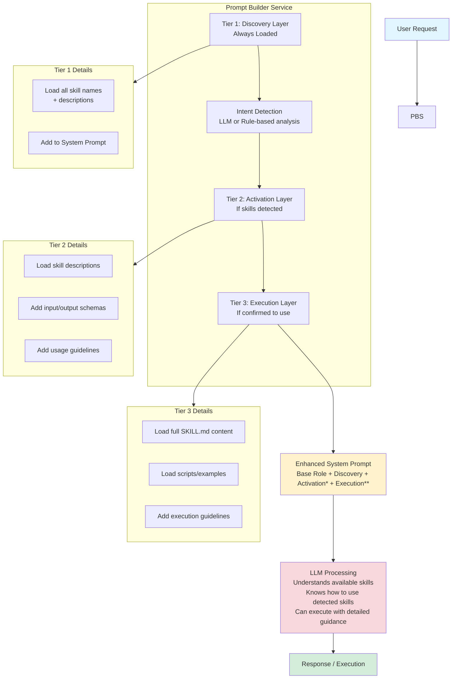
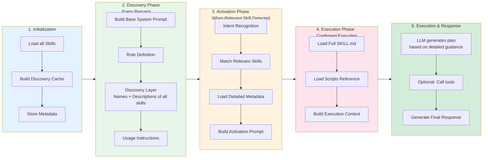

# Skill Prompt Integration Guide (Progressive Disclosure)

**Languages**: [中文](skill-prompt-integration.md) | [English](skill-prompt-integration_EN.md)

This document describes how third-party Spring AI services can integrate the prompt-based guidance of Agent Skill Manager through the Progressive Disclosure mechanism following the agentskills.io specification.

## Table of Contents

1. [Core Concepts](#core-concepts)
2. [Architectural Design](#architectural-design)
3. [Integration Steps](#integration-steps)
4. [Three Integration Modes](#three-integration-modes)
5. [Full Code Example](#full-code-example)
6. [Performance Optimization](#performance-optimization)
7. [Best Practices](#best-practices)

---

## Core Concepts

### What is Progressive Disclosure?

Progressive Disclosure is a context management strategy defined by the agentskills.io specification. It provides information to the LLM in three tiers:

1. **Tier 1: Discovery Layer** - Only includes skill names and short descriptions (approx. 100 tokens). Always loaded in the system prompt.
2. **Tier 2: Activation Layer** - Includes metadata, parameters, and usage guidelines (approx. 500 tokens). Loaded when relevant skills are detected.
3. **Tier 3: Execution Layer** - Includes full `SKILL.md` instructions, scripts, and examples (can be several thousand tokens). Loaded only when the skill execution is confirmed.

### Benefits

- **Save Context (Tokens)**: Avoid overwhelming the LLM with unnecessary details.
- **Improve Accuracy**: Reduce "distractions" by only providing detailed guidance when needed.
- **Scale to Hundreds of Skills**: Can support a large library of skills without exceeding context limits.

---

## Architectural Design

### System Architecture Diagram



\* If relevant skills detected  \*\* If skill execution confirmed

### Data Flow Detail



---

## Integration Steps

### Step 1: Add Dependencies

```xml
<dependencies>
    <!-- Spring AI -->
    <dependency>
        <groupId>org.springframework.ai</groupId>
        <artifactId>spring-ai-core</artifactId>
    </dependency>
    
    <!-- Agent Skill Manager -->
    <dependency>
        <groupId>org.unreal</groupId>
        <artifactId>agent-skill-manager</artifactId>
        <version>1.0-SNAPSHOT</version>
    </dependency>
    
    <!-- For agentskills.io format support -->
    <dependency>
        <groupId>com.fasterxml.jackson.dataformat</groupId>
        <artifactId>jackson-dataformat-yaml</artifactId>
    </dependency>
</dependencies>
```

### Step 2: Configuration

```yaml
# application.yml
agent:
  skill:
    enabled: true
    folder-based-skills: true
    skills-directory: "skills"
    
    # Progressive disclosure configuration
    agentskills-enabled: true
    progressive-disclosure: true
    max-skill-md-size-kb: 100
    
spring:
  ai:
    openai:
      api-key: ${OPENAI_API_KEY}
```

### Step 3: Create Prompt Builder Service

```java
@Service
public class ProgressivePromptBuilder {
    
    @Autowired
    private AgentSkillManager skillManager;
    
    @Autowired
    private SpringAIAgentSkillAdapter skillAdapter;
    
    // Cache Discovery Layer (avoid rebuilding every time)
    private String discoveryLayerCache;
    
    @PostConstruct
    public void init() {
        buildDiscoveryLayerCache();
    }
    
    /**
     * Tier 1: Discovery Layer - Lightweight, loaded every request
     */
    private void buildDiscoveryLayerCache() {
        StringBuilder discovery = new StringBuilder();
        discovery.append("\n## Available Skills\n\n");
        discovery.append("You have access to the following specialized skills:\n\n");
        
        // Get discovery info for all skills
        List<String> discoveryInfo = skillAdapter.getSkillDiscoveryInfo();
        
        for (String info : discoveryInfo) {
            discovery.append("- ").append(info).append("\n");
        }
        
        discovery.append("\nWhen a user's request matches one of these skills, ");
        discovery.append("explicitly mention you will use that skill to help them.\n");
        
        this.discoveryLayerCache = discovery.toString();
    }
    
    /**
     * Build Base Prompt (Discovery Layer only)
     */
    public String buildBasePrompt(String baseRole) {
        return baseRole + "\n" + discoveryLayerCache;
    }
    
    /**
     * Tier 2: Activation Layer - Loaded when relevant skills are detected
     */
    public String buildActivationPrompt(String basePrompt, List<String> skillNames) {
        StringBuilder prompt = new StringBuilder(basePrompt);
        
        prompt.append("\n\n## Relevant Skills for This Request\n\n");
        
        for (String skillName : skillNames) {
            AgentSkill skill = skillManager.getSkill(skillName);
            if (skill != null) {
                addActivationLayer(prompt, skill);
            }
        }
        
        return prompt.toString();
    }
    
    private void addActivationLayer(StringBuilder prompt, AgentSkill skill) {
        prompt.append(String.format("""
            ### %s
            
            **Description:** %s
            
            **Version:** %s
            
            **Parameters:**
            - Required: %s
            - Optional: %s
            
            **When to use:** Use this skill when the user needs to %s
            
            """,
            skill.getName(),
            skill.getDescription(),
            skill.getVersion(),
            skill.getRequiredParameters(),
            skill.getOptionalParameters(),
            extractUsageHint(skill.getDescription())
        ));
    }
    
    /**
     * Tier 3: Execution Layer - Load full instructions when execution confirmed
     */
    public String buildExecutionPrompt(String activationPrompt, String skillName) {
        StringBuilder prompt = new StringBuilder(activationPrompt);
        
        AgentSkill skill = skillManager.getSkill(skillName);
        if (skill == null) {
            return activationPrompt;
        }
        
        String instructions = skill.getInstructions();
        if (instructions != null && !instructions.isEmpty()) {
            prompt.append("\n\n## Skill Execution Guide: ").append(skillName).append("\n\n");
            prompt.append(instructions);
            prompt.append("\n\n");
            prompt.append("Follow the above instructions carefully to complete the task. ");
            prompt.append("If you need to use the tools mentioned in the instructions, ");
            prompt.append("explicitly state which tool you are using and why.\n");
        }
        
        return prompt.toString();
    }
    
    private String extractUsageHint(String description) {
        if (description.toLowerCase().contains("use when")) {
            int start = description.toLowerCase().indexOf("use when");
            return description.substring(start);
        }
        return "perform related tasks";
    }
}
```

### Step 4: Implement Intent Detection

```java
@Service
public class SkillIntentDetector {
    
    @Autowired
    private ChatClient chatClient;
    
    @Autowired
    private AgentSkillManager skillManager;
    
    /**
     * Detect user intent and relevant skills using LLM
     */
    public List<String> detectRelevantSkills(String userMessage) {
        List<String> skillDescriptions = skillManager.getAllSkills().stream()
            .map(skill -> String.format("%s: %s", skill.getName(), skill.getDescription()))
            .collect(Collectors.toList());
        
        String detectionPrompt = String.format("""
            Analyze the following user request and determine which skills are relevant.
            
            User Request: "%s"
            
            Available Skills:
            %s
            
            Identify which skills (if any) would be helpful for this request.
            Return ONLY a JSON array of skill names, e.g., ["text-analysis", "datetime"]
            If no skills are relevant, return []
            """,
            userMessage,
            String.join("\n", skillDescriptions)
        );
        
        String response = chatClient.prompt()
            .user(detectionPrompt)
            .call()
            .content();
        
        try {
            return parseSkillList(response);
        } catch (Exception e) {
            return new ArrayList<>();
        }
    }
    
    /**
     * Rule-based detection (faster, but less intelligent)
     */
    public List<String> detectRelevantSkillsRuleBased(String userMessage) {
        List<String> relevantSkills = new ArrayList<>();
        String lowerMessage = userMessage.toLowerCase();
        
        for (AgentSkill skill : skillManager.getAllSkills()) {
            String name = skill.getName().toLowerCase();
            String desc = skill.getDescription().toLowerCase();
            
            if (lowerMessage.contains(name) || 
                containsKeywords(lowerMessage, desc)) {
                relevantSkills.add(skill.getName());
            }
        }
        
        return relevantSkills;
    }
    
    private boolean containsKeywords(String message, String description) {
        String[] keywords = description.split("\\s+");
        int matchCount = 0;
        
        for (String keyword : keywords) {
            if (keyword.length() > 4 && message.contains(keyword.toLowerCase())) {
                matchCount++;
            }
        }
        
        return matchCount >= 2;
    }
    
    @SuppressWarnings("unchecked")
    private List<String> parseSkillList(String json) {
        try {
            ObjectMapper mapper = new ObjectMapper();
            return mapper.readValue(json, List.class);
        } catch (Exception e) {
            return new ArrayList<>();
        }
    }
}
```

---

## Three Integration Modes

### Mode 1: Single-Turn (Simplest)

Ideal for simple Q&A scenarios where you build the full prompt at once.

```java
@Service
public class SingleTurnSkillService {
    
    @Autowired
    private ProgressivePromptBuilder promptBuilder;
    
    @Autowired
    private SkillIntentDetector intentDetector;
    
    @Autowired
    private ChatClient chatClient;
    
    public String chat(String userMessage) {
        // 1. Build Base Prompt (including Discovery)
        String basePrompt = promptBuilder.buildBasePrompt(
            "You are a helpful AI assistant."
        );
        
        // 2. Detect relevant skills
        List<String> relevantSkills = intentDetector.detectRelevantSkills(userMessage);
        
        String finalPrompt;
        if (!relevantSkills.isEmpty()) {
            // 3. Add Activation Layer
            String activationPrompt = promptBuilder.buildActivationPrompt(
                basePrompt, relevantSkills
            );
            
            // 4. For single-turn, load Execution Layer directly
            finalPrompt = promptBuilder.buildExecutionPrompt(
                activationPrompt, relevantSkills.get(0)
            );
        } else {
            finalPrompt = basePrompt;
        }
        
        // 5. Call LLM
        return chatClient.prompt()
            .system(finalPrompt)
            .user(userMessage)
            .call()
            .content();
    }
}
```

**Use Case:**
- Independent task requests
- No multi-turn interaction needed
- Relatively simple skill execution

### Mode 2: Multi-Turn (Recommended)

Ideal for complex tasks, loading different tiers of information in stages.

```java
@Service
public class MultiTurnSkillService {
    
    @Autowired
    private ProgressivePromptBuilder promptBuilder;
    
    @Autowired
    private SkillIntentDetector intentDetector;
    
    @Autowired
    private ChatClient chatClient;
    
    // Session state storage (use Redis in production)
    private Map<String, ConversationState> sessionStates = new ConcurrentHashMap<>();
    
    public String chat(String sessionId, String userMessage) {
        ConversationState state = sessionStates.computeIfAbsent(
            sessionId, k -> new ConversationState()
        );
        
        // Phase 1: If no active skill, detect first
        if (state.getActiveSkill() == null) {
            return handleDiscoveryPhase(state, userMessage);
        }
        
        // Phase 2: Active skill exists, enter execution phase
        return handleExecutionPhase(state, userMessage);
    }
    
    private String handleDiscoveryPhase(ConversationState state, String userMessage) {
        String basePrompt = promptBuilder.buildBasePrompt(
            "You are a helpful AI assistant."
        );
        
        List<String> skills = intentDetector.detectRelevantSkills(userMessage);
        
        if (skills.isEmpty()) {
            return chatClient.prompt()
                .system(basePrompt)
                .user(userMessage)
                .call()
                .content();
        }
        
        // 3. Add Activation Layer, ask for confirmation
        String activationPrompt = promptBuilder.buildActivationPrompt(basePrompt, skills);
        
        String response = chatClient.prompt()
            .system(activationPrompt)
            .user(userMessage + "\n\nPlease confirm if you want me to use the " + 
                  skills.get(0) + " skill to help you. Reply 'yes' to proceed.")
            .call()
            .content();
        
        state.setPendingSkill(skills.get(0));
        return response;
    }
    
    private String handleExecutionPhase(ConversationState state, String userMessage) {
        if (state.getPendingSkill() != null && 
            userMessage.toLowerCase().contains("yes")) {
            
            state.setActiveSkill(state.getPendingSkill());
            state.setPendingSkill(null);
        }
        
        String activeSkill = state.getActiveSkill();
        if (activeSkill == null) {
            return "Please confirm which skill you'd like to use.";
        }
        
        // Build Full Execution Prompt
        String basePrompt = promptBuilder.buildBasePrompt("You are a helpful AI assistant.");
        String activationPrompt = promptBuilder.buildActivationPrompt(basePrompt, List.of(activeSkill));
        String executionPrompt = promptBuilder.buildExecutionPrompt(activationPrompt, activeSkill);
        
        String response = chatClient.prompt()
            .system(executionPrompt)
            .user(userMessage)
            .call()
            .content();
        
        state.addToHistory("user", userMessage);
        state.addToHistory("assistant", response);
        
        return response;
    }
    
    @Data
    private static class ConversationState {
        private String pendingSkill;
        private String activeSkill;
        private List<Map<String, String>> history = new ArrayList<>();
        
        public void addToHistory(String role, String content) {
            history.add(Map.of("role", role, "content", content));
        }
    }
}
```

**Use Case:**
- Requires user confirmation
- Complex skills needing detailed guidance
- Maintenance of conversation context

### Mode 3: Hybrid (Function Calling + Prompt)

Combines the best of both: Function Calling for triggering, Prompt for guidance.

```java
@Service
public class HybridSkillService {
    
    @Autowired
    private SpringAIAgentSkillAdapter skillAdapter;
    
    @Autowired
    private ProgressivePromptBuilder promptBuilder;
    
    @Autowired
    private ChatClient chatClient;
    
    public String chat(String userMessage) {
        // 1. Build System Prompt with Discovery
        String systemPrompt = promptBuilder.buildBasePrompt(
            "You are a helpful AI assistant."
        );
        
        // 2. Use Function Calling to detect if a skill is needed
        var functions = skillAdapter.getFunctionDefinitions();
        
        String initialResponse = chatClient.prompt()
            .system(systemPrompt)
            .user(userMessage)
            .functions(functions)
            .call()
            .content();
        
        // 3. Check if LLM requested a function call
        if (containsFunctionCall(initialResponse)) {
            String skillName = extractSkillName(initialResponse);
            
            // 4. Load Execution Layer
            String enhancedPrompt = promptBuilder.buildExecutionPrompt(
                systemPrompt, skillName
            );
            
            // 5. Re-call, this time with detailed instructions
            return chatClient.prompt()
                .system(enhancedPrompt)
                .user(userMessage + "\n\nUse the " + skillName + 
                      " skill following the provided instructions.")
                .call()
                .content();
        }
        
        return initialResponse;
    }
    
    private boolean containsFunctionCall(String response) {
        return response.contains("function_call") || response.contains("tool_calls");
    }
    
    private String extractSkillName(String response) {
        return "extracted-skill-name";
    }
}
```

**Use Case:**
- Needs both automatic triggering and detailed guidance
- Skills have complex multi-step execution flows

---

## Full Code Example

### Example 1: Full Chat Controller

```java
@RestController
@RequestMapping("/api/chat")
public class ProgressiveChatController {
    
    @Autowired
    private MultiTurnSkillService skillService;
    
    @Autowired
    private ProgressivePromptBuilder promptBuilder;
    
    @Autowired
    private SpringAIAgentSkillAdapter skillAdapter;
    
    /**
     * Standard Chat Endpoint (supports Progressive Disclosure)
     */
    @PostMapping
    public ResponseEntity<ChatResponse> chat(
            @RequestHeader("X-Session-Id") String sessionId,
            @RequestBody ChatRequest request) {
        
        String response = skillService.chat(sessionId, request.getMessage());
        
        return ResponseEntity.ok(ChatResponse.builder()
            .content(response)
            .sessionId(sessionId)
            .timestamp(System.currentTimeMillis())
            .build());
    }
    
    /**
     * Get Current System Prompt (for debugging)
     */
    @GetMapping("/debug/prompt")
    public ResponseEntity<String> getCurrentPrompt(@RequestParam String skillName) {
        String basePrompt = promptBuilder.buildBasePrompt("AI Assistant");
        String fullPrompt = promptBuilder.buildExecutionPrompt(basePrompt, skillName);
        return ResponseEntity.ok(fullPrompt);
    }
}

// DTOs
@Data
public class ChatRequest {
    private String message;
}

@Data
@Builder
public class ChatResponse {
    private String content;
    private String sessionId;
    private long timestamp;
}
```

### Example 2: Cache-Optimized Prompt Builder

```java
@Service
public class CachedPromptBuilder {
    
    @Autowired
    private AgentSkillManager skillManager;
    
    @Autowired
    private SpringAIAgentSkillAdapter skillAdapter;
    
    private String discoveryCache;
    private final Map<String, String> activationCache = new ConcurrentHashMap<>();
    private final Map<String, String> executionCache = new ConcurrentHashMap<>();
    
    @PostConstruct
    public void init() {
        buildDiscoveryCache();
        preloadSkillCaches();
    }
    
    private void buildDiscoveryCache() {
        StringBuilder sb = new StringBuilder();
        sb.append("## Available Skills\n\n");
        for (String info : skillAdapter.getSkillDiscoveryInfo()) {
            sb.append("- ").append(info).append("\n");
        }
        this.discoveryCache = sb.toString();
    }
    
    private void preloadSkillCaches() {
        for (AgentSkill skill : skillManager.getAllSkills()) {
            activationCache.put(skill.getName(), buildActivationForSkill(skill));
            if (skill.getInstructions() != null) {
                executionCache.put(skill.getName(), skill.getInstructions());
            }
        }
    }
    
    public String buildPrompt(List<String> skillNames, boolean includeExecution) {
        StringBuilder prompt = new StringBuilder(discoveryCache);
        for (String skillName : skillNames) {
            String activation = activationCache.get(skillName);
            if (activation != null) prompt.append(activation);
        }
        if (includeExecution) {
            for (String skillName : skillNames) {
                String execution = executionCache.get(skillName);
                if (execution != null) {
                    prompt.append("\n## Execution Guide: ").append(skillName)
                          .append("\n").append(execution).append("\n");
                }
            }
        }
        return prompt.toString();
    }
}
```

---

## Performance Optimization

### 1. Token Budgeting

```java
@Service
public class TokenBudgetService {
    private static final int MAX_CONTEXT_TOKENS = 8000;
    
    public DisclosureLevel calculateOptimalLevel(List<String> relevantSkills, int userMessageTokens) {
        int availableTokens = MAX_CONTEXT_TOKENS - userMessageTokens - 1000;
        // Logic to determine level based on token counts
        return DisclosureLevel.FULL_EXECUTION;
    }
    
    public enum DisclosureLevel {
        DISCOVERY_ONLY, ACTIVATION, FULL_EXECUTION
    }
}
```

### 2. Intelligent Caching

- Use Caffeine or Redis to cache `instructions` and `activation` prompts.
- Implement async pre-loading for likely required skills based on user input.

---

## Best Practices

### 1. Prompt Structure

- **Clear Tiers**: Keep boundaries between Discovery, Activation, and Execution clear.
- **Explicit Rules**: Tell the LLM *when* to use a skill and *not* to use it if unsure.
- **User Confirmation**: For high-impact skills, always prompt the LLM to ask for user confirmation.

### 2. Error Fallbacks

- If a skill fails or exceeds context limits, fall back to a lower disclosure level (Discovery only).
- Provide clean error messages so the LLM can explain the issue to the user.

---

**Next Step**: Learn how to implement automated skill calling through [Tools Integration](tool-integration_EN.md).
