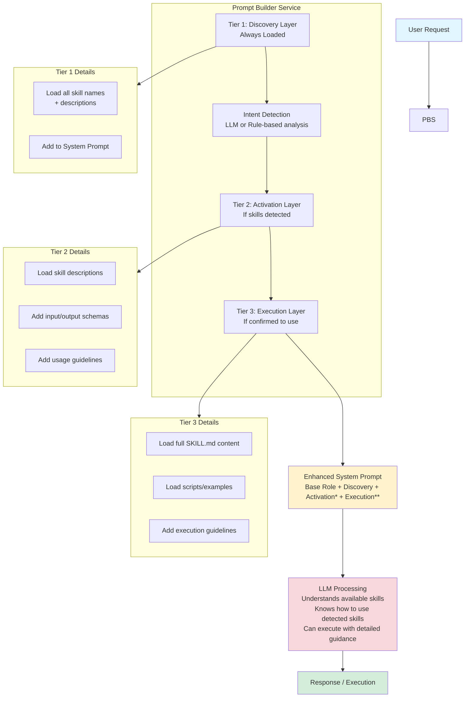
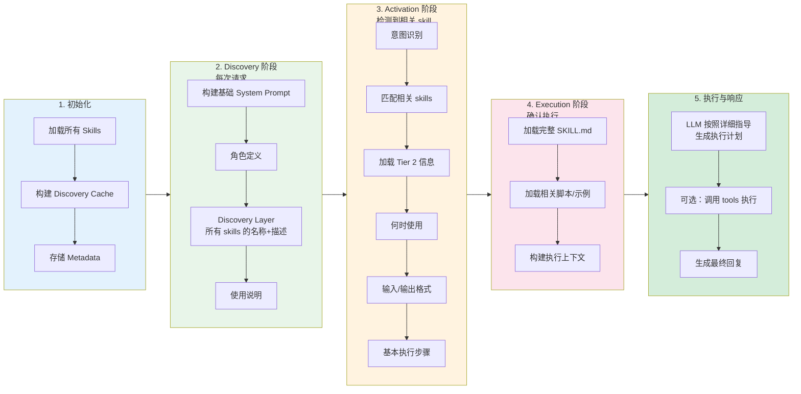

# Skill Prompt 渐进式披露集成指南

本文档介绍第三方 Spring AI 服务如何将 Agent Skill Manager 中的 skills（特别是 agentskills.io 格式的 SKILL.md）通过渐进式披露方式植入到 LLM 的 Prompt 中，实现更智能、更精确的 skill 调用。

## 目录

1. [核心概念](#核心概念)
2. [渐进式披露模型](#渐进式披露模型)
3. [架构设计](#架构设计)
4. [集成步骤](#集成步骤)
5. [三种集成模式](#三种集成模式)
6. [完整代码示例](#完整代码示例)
7. [性能优化](#性能优化)
8. [最佳实践](#最佳实践)

---

## 核心概念

### 什么是渐进式披露？

渐进式披露（Progressive Disclosure）是一种信息架构策略：

- **分层加载**：不一次性加载所有信息，而是按需分层加载
- **上下文感知**：根据当前对话阶段，加载最相关的信息
- **Token 优化**：避免浪费 LLM 的上下文窗口

### 与 Function Calling 的区别

| 维度 | Function Calling | Skill Prompt |
|------|------------------|--------------|
| **触发方式** | LLM 自动识别函数调用 | 显式植入到 System Prompt |
| **控制粒度** | 函数级别的调用 | 详细的执行指导 |
| **灵活性** | 由 LLM 决定参数和执行 | 您控制完整的执行流程 |
| **适用场景** | 标准工具调用 | 复杂任务、多步骤流程 |

**最佳实践**：两者结合使用！Function Calling 用于触发，Skill Prompt 用于指导执行。

---

## 渐进式披露模型

基于 agentskills.io 规范，我们定义了三层披露模型：

### Tier 1: Discovery（发现层）

- **加载时机**：每次对话开始时
- **内容量级**：轻量级（~100-200 tokens）
- **包含信息**：
  - 技能名称
  - 一句话描述
  - 适用场景关键词

```markdown
You have access to these skills:
- text-analysis: Analyze text for word count, sentiment, and keywords. 
  Use for: text processing, content analysis, word statistics
- pdf-processing: Extract text and data from PDF documents.
  Use for: document parsing, PDF content extraction
```

### Tier 2: Activation（激活层）

- **加载时机**：LLM 识别到需要使用某个 skill
- **内容量级**：中等（~500-2000 tokens）
- **包含信息**：
  - 完整描述
  - 何时使用此 skill
  - 输入/输出格式
  - 执行步骤概述

```markdown
## Skill: text-analysis

### When to Use
Use this skill when the user needs to:
- Analyze text content for statistics
- Check sentiment of reviews or feedback
- Extract keywords from documents

### Input Format
```json
{
  "text": "string (required) - The text to analyze",
  "analysis_type": "string (optional) - 'full', 'sentiment_only', 'keywords_only'"
}
```

### Output Format
The skill returns a JSON object with:
```
- word_count: number
- character_count: number
- sentiment: 'positive' | 'negative' | 'neutral'
- keywords: string[]
```

### Tier 3: Execution（执行层）

- **加载时机**：实际执行 skill 时
- **内容量级**：完整（可能 2000+ tokens）
- **包含信息**：
  - 完整的 SKILL.md 内容
  - 详细执行步骤
  - 示例和边界情况
  - 错误处理指南
  - 相关脚本和工具

# Text Analysis Skill - Complete Guide

## Overview
This skill provides comprehensive text analysis capabilities...

## Detailed Instructions

### Step 1: Text Preprocessing
- Remove HTML tags if present
- Normalize whitespace
- Handle encoding issues

### Step 2: Word Count Analysis
Use the formula: total words = split by whitespace and count

### Step 3: Sentiment Analysis
1. Identify positive keywords: [...]
2. Identify negative keywords: [...]
3. Calculate sentiment score
4. Classify as positive/negative/neutral

## Examples

### Example 1: Product Review
Input: "This product is amazing!"
Processing:
1. Word count: 5
2. Sentiment keywords found: "amazing" (+1)
3. Result: positive

## Error Handling
- Empty text: Return error "Text cannot be empty"
- Non-string input: Attempt to convert to string
- Very long text (>10000 chars): Process in chunks

## Scripts Available
- scripts/text-processor.py: Main processing script
- scripts/sentiment-model.py: Advanced sentiment analysis
```

---

## 架构设计

### 系统架构图



\* If relevant skills detected  \*\* If skill execution confirmed

### 数据流详解



---

## 集成步骤

### 步骤 1：添加依赖

```xml
<dependencies>
    <!-- Spring AI -->
    <dependency>
        <groupId>org.springframework.ai</groupId>
        <artifactId>spring-ai-core</artifactId>
    </dependency>
    
    <!-- Agent Skill Manager -->
    <dependency>
        <groupId>org.unreal</groupId>
        <artifactId>agent-skill-manager</artifactId>
        <version>1.0-SNAPSHOT</version>
    </dependency>
    
    <!-- For agentskills.io format support -->
    <dependency>
        <groupId>com.fasterxml.jackson.dataformat</groupId>
        <artifactId>jackson-dataformat-yaml</artifactId>
    </dependency>
</dependencies>
```

### 步骤 2：配置

```yaml
# application.yml
agent:
  skill:
    enabled: true
    folder-based-skills: true
    skills-directory: "skills"
    
    # 渐进式披露配置
    agentskills-enabled: true
    progressive-disclosure: true
    max-skill-md-size-kb: 100
    
spring:
  ai:
    openai:
      api-key: ${OPENAI_API_KEY}
```

### 步骤 3：创建 Prompt 构建服务

```java
@Service
public class ProgressivePromptBuilder {
    
    @Autowired
    private AgentSkillManager skillManager;
    
    @Autowired
    private SpringAIAgentSkillAdapter skillAdapter;
    
    // 缓存 Discovery Layer（避免每次重新构建）
    private String discoveryLayerCache;
    
    @PostConstruct
    public void init() {
        buildDiscoveryLayerCache();
    }
    
    /**
     * Tier 1: Discovery Layer - 轻量级，每次请求都加载
     */
    private void buildDiscoveryLayerCache() {
        StringBuilder discovery = new StringBuilder();
        discovery.append("\n## Available Skills\n\n");
        discovery.append("You have access to the following specialized skills:\n\n");
        
        // 获取所有技能的发现信息
        List<String> discoveryInfo = skillAdapter.getSkillDiscoveryInfo();
        
        for (String info : discoveryInfo) {
            discovery.append("- ").append(info).append("\n");
        }
        
        discovery.append("\nWhen a user's request matches one of these skills, ");
        discovery.append("explicitly mention you will use that skill to help them.\n");
        
        this.discoveryLayerCache = discovery.toString();
    }
    
    /**
     * 构建基础 Prompt（仅 Discovery Layer）
     */
    public String buildBasePrompt(String baseRole) {
        return baseRole + "\n" + discoveryLayerCache;
    }
    
    /**
     * Tier 2: Activation Layer - 检测到相关技能时加载
     */
    public String buildActivationPrompt(String basePrompt, List<String> skillNames) {
        StringBuilder prompt = new StringBuilder(basePrompt);
        
        prompt.append("\n\n## Relevant Skills for This Request\n\n");
        
        for (String skillName : skillNames) {
            AgentSkill skill = skillManager.getSkill(skillName);
            if (skill != null) {
                addActivationLayer(prompt, skill);
            }
        }
        
        return prompt.toString();
    }
    
    private void addActivationLayer(StringBuilder prompt, AgentSkill skill) {
        prompt.append(String.format("""
            ### %s
            
            **Description:** %s
            
            **Version:** %s
            
            **Parameters:**
            - Required: %s
            - Optional: %s
            
            **When to use:** Use this skill when the user needs to %s
            
            """,
            skill.getName(),
            skill.getDescription(),
            skill.getVersion(),
            skill.getRequiredParameters(),
            skill.getOptionalParameters(),
            extractUsageHint(skill.getDescription())
        ));
    }
    
    /**
     * Tier 3: Execution Layer - 确认执行时加载完整 instructions
     */
    public String buildExecutionPrompt(String activationPrompt, String skillName) {
        StringBuilder prompt = new StringBuilder(activationPrompt);
        
        AgentSkill skill = skillManager.getSkill(skillName);
        if (skill == null) {
            return activationPrompt;
        }
        
        String instructions = skill.getInstructions();
        if (instructions != null && !instructions.isEmpty()) {
            prompt.append("\n\n## Skill Execution Guide: ").append(skillName).append("\n\n");
            prompt.append(instructions);
            prompt.append("\n\n");
            prompt.append("Follow the above instructions carefully to complete the task. ");
            prompt.append("If you need to use the tools mentioned in the instructions, ");
            prompt.append("explicitly state which tool you are using and why.\n");
        }
        
        return prompt.toString();
    }
    
    private String extractUsageHint(String description) {
        // 从描述中提取使用提示
        if (description.toLowerCase().contains("use when")) {
            int start = description.toLowerCase().indexOf("use when");
            return description.substring(start);
        }
        return "perform related tasks";
    }
}
```

### 步骤 4：实现意图检测

```java
@Service
public class SkillIntentDetector {
    
    @Autowired
    private ChatClient chatClient;
    
    @Autowired
    private AgentSkillManager skillManager;
    
    /**
     * 使用 LLM 检测用户意图和相关 skills
     */
    public List<String> detectRelevantSkills(String userMessage) {
        // 获取所有技能名称和描述
        List<String> skillDescriptions = skillManager.getAllSkills().stream()
            .map(skill -> String.format("%s: %s", skill.getName(), skill.getDescription()))
            .collect(Collectors.toList());
        
        // 构建检测提示词
        String detectionPrompt = String.format("""
            Analyze the following user request and determine which skills are relevant.
            
            User Request: "%s"
            
            Available Skills:
            %s
            
            Identify which skills (if any) would be helpful for this request.
            Return ONLY a JSON array of skill names, e.g., ["text-analysis", "datetime"]
            If no skills are relevant, return []
            """,
            userMessage,
            String.join("\n", skillDescriptions)
        );
        
        String response = chatClient.prompt()
            .user(detectionPrompt)
            .call()
            .content();
        
        // 解析 JSON 响应
        try {
            return parseSkillList(response);
        } catch (Exception e) {
            return new ArrayList<>();
        }
    }
    
    /**
     * 规则-based 检测（更快，但不够智能）
     */
    public List<String> detectRelevantSkillsRuleBased(String userMessage) {
        List<String> relevantSkills = new ArrayList<>();
        String lowerMessage = userMessage.toLowerCase();
        
        for (AgentSkill skill : skillManager.getAllSkills()) {
            String name = skill.getName().toLowerCase();
            String desc = skill.getDescription().toLowerCase();
            
            // 简单的关键词匹配
            if (lowerMessage.contains(name) || 
                containsKeywords(lowerMessage, desc)) {
                relevantSkills.add(skill.getName());
            }
        }
        
        return relevantSkills;
    }
    
    private boolean containsKeywords(String message, String description) {
        // 提取描述中的关键词并检查
        String[] keywords = description.split("\\s+");
        int matchCount = 0;
        
        for (String keyword : keywords) {
            if (keyword.length() > 4 && message.contains(keyword.toLowerCase())) {
                matchCount++;
            }
        }
        
        return matchCount >= 2;  // 至少匹配2个关键词
    }
    
    @SuppressWarnings("unchecked")
    private List<String> parseSkillList(String json) {
        try {
            ObjectMapper mapper = new ObjectMapper();
            return mapper.readValue(json, List.class);
        } catch (Exception e) {
            return new ArrayList<>();
        }
    }
}
```

---

## 三种集成模式

### 模式 1：单轮对话（最简单）

适合简单的问答场景，一次性构建完整 prompt。

```java
@Service
public class SingleTurnSkillService {
    
    @Autowired
    private ProgressivePromptBuilder promptBuilder;
    
    @Autowired
    private SkillIntentDetector intentDetector;
    
    @Autowired
    private ChatClient chatClient;
    
    public String chat(String userMessage) {
        // 1. 构建基础 Prompt（包含 Discovery）
        String basePrompt = promptBuilder.buildBasePrompt(
            "You are a helpful AI assistant."
        );
        
        // 2. 检测相关 skills
        List<String> relevantSkills = intentDetector.detectRelevantSkills(userMessage);
        
        String finalPrompt;
        if (!relevantSkills.isEmpty()) {
            // 3. 添加 Activation Layer
            String activationPrompt = promptBuilder.buildActivationPrompt(
                basePrompt, relevantSkills
            );
            
            // 4. 对于单轮对话，直接加载 Execution Layer
            //（假设 LLM 会按照 instructions 执行）
            finalPrompt = promptBuilder.buildExecutionPrompt(
                activationPrompt, relevantSkills.get(0)
            );
        } else {
            finalPrompt = basePrompt;
        }
        
        // 5. 调用 LLM
        return chatClient.prompt()
            .system(finalPrompt)
            .user(userMessage)
            .call()
            .content();
    }
}
```

**适用场景**：
- 独立的任务请求
- 不需要多轮交互
- Skills 执行相对简单

### 模式 2：多轮对话（推荐）

适合复杂的任务，分阶段加载不同层级的信息。

```java
@Service
public class MultiTurnSkillService {
    
    @Autowired
    private ProgressivePromptBuilder promptBuilder;
    
    @Autowired
    private SkillIntentDetector intentDetector;
    
    @Autowired
    private ChatClient chatClient;
    
    // 会话状态存储（生产环境使用 Redis）
    private Map<String, ConversationState> sessionStates = new ConcurrentHashMap<>();
    
    public String chat(String sessionId, String userMessage) {
        ConversationState state = sessionStates.computeIfAbsent(
            sessionId, k -> new ConversationState()
        );
        
        // 阶段 1：如果没有激活的 skill，先检测
        if (state.getActiveSkill() == null) {
            return handleDiscoveryPhase(state, userMessage);
        }
        
        // 阶段 2：已有激活的 skill，进入执行阶段
        return handleExecutionPhase(state, userMessage);
    }
    
    private String handleDiscoveryPhase(ConversationState state, String userMessage) {
        // 1. 构建基础 Prompt
        String basePrompt = promptBuilder.buildBasePrompt(
            "You are a helpful AI assistant."
        );
        
        // 2. 检测相关 skills
        List<String> skills = intentDetector.detectRelevantSkills(userMessage);
        
        if (skills.isEmpty()) {
            // 没有匹配的 skill，普通对话
            return chatClient.prompt()
                .system(basePrompt)
                .user(userMessage)
                .call()
                .content();
        }
        
        // 3. 添加 Activation Layer，询问用户确认
        String activationPrompt = promptBuilder.buildActivationPrompt(basePrompt, skills);
        
        String response = chatClient.prompt()
            .system(activationPrompt)
            .user(userMessage + "\n\nPlease confirm if you want me to use the " + 
                  skills.get(0) + " skill to help you. Reply 'yes' to proceed.")
            .call()
            .content();
        
        // 保存状态
        state.setPendingSkill(skills.get(0));
        
        return response;
    }
    
    private String handleExecutionPhase(ConversationState state, String userMessage) {
        // 用户确认使用 skill
        if (state.getPendingSkill() != null && 
            userMessage.toLowerCase().contains("yes")) {
            
            state.setActiveSkill(state.getPendingSkill());
            state.setPendingSkill(null);
        }
        
        String activeSkill = state.getActiveSkill();
        if (activeSkill == null) {
            return "Please confirm which skill you'd like to use.";
        }
        
        // 构建完整 Execution Prompt
        String basePrompt = promptBuilder.buildBasePrompt(
            "You are a helpful AI assistant."
        );
        String activationPrompt = promptBuilder.buildActivationPrompt(
            basePrompt, List.of(activeSkill)
        );
        String executionPrompt = promptBuilder.buildExecutionPrompt(
            activationPrompt, activeSkill
        );
        
        // 执行并维护对话历史
        String response = chatClient.prompt()
            .system(executionPrompt)
            .user(userMessage)
            .call()
            .content();
        
        // 添加到历史
        state.addToHistory("user", userMessage);
        state.addToHistory("assistant", response);
        
        return response;
    }
    
    @Data
    private static class ConversationState {
        private String pendingSkill;
        private String activeSkill;
        private List<Map<String, String>> history = new ArrayList<>();
        
        public void addToHistory(String role, String content) {
            history.add(Map.of("role", role, "content", content));
        }
    }
}
```

**适用场景**：
- 需要用户确认是否使用 skill
- 复杂的 skills 需要详细指导
- 需要维护对话上下文

### 模式 3：混合模式（Function Calling + Prompt）

结合两种模式的优势：Function Calling 用于触发，Prompt 用于指导。

```java
@Service
public class HybridSkillService {
    
    @Autowired
    private SpringAIAgentSkillAdapter skillAdapter;
    
    @Autowired
    private ProgressivePromptBuilder promptBuilder;
    
    @Autowired
    private ChatClient chatClient;
    
    public String chat(String userMessage) {
        // 1. 构建包含 Discovery 的 System Prompt
        String systemPrompt = promptBuilder.buildBasePrompt(
            "You are a helpful AI assistant."
        );
        
        // 2. 使用 Function Calling 检测是否需要 skill
        var functions = skillAdapter.getFunctionDefinitions();
        
        String initialResponse = chatClient.prompt()
            .system(systemPrompt)
            .user(userMessage)
            .functions(functions)
            .call()
            .content();
        
        // 3. 检查 LLM 是否请求了函数调用
        if (containsFunctionCall(initialResponse)) {
            String skillName = extractSkillName(initialResponse);
            
            // 4. 加载 Execution Layer
            String enhancedPrompt = promptBuilder.buildExecutionPrompt(
                systemPrompt, skillName
            );
            
            // 5. 重新调用，这次带有详细 instructions
            return chatClient.prompt()
                .system(enhancedPrompt)
                .user(userMessage + "\n\nUse the " + skillName + 
                      " skill following the provided instructions.")
                .call()
                .content();
        }
        
        return initialResponse;
    }
    
    private boolean containsFunctionCall(String response) {
        return response.contains("function_call") || 
               response.contains("tool_calls");
    }
    
    private String extractSkillName(String response) {
        // 解析函数调用响应提取 skill 名称
        // 实际实现取决于响应格式
        return "extracted-skill-name";
    }
}
```

**适用场景**：
- 既需要自动触发，又需要详细指导
- Skills 有复杂的多步骤执行流程

---

## 完整代码示例

### 示例 1：完整的 Chat Controller

```java
@RestController
@RequestMapping("/api/chat")
public class ProgressiveChatController {
    
    @Autowired
    private MultiTurnSkillService skillService;
    
    @Autowired
    private ProgressivePromptBuilder promptBuilder;
    
    @Autowired
    private SpringAIAgentSkillAdapter skillAdapter;
    
    /**
     * 标准聊天接口（支持渐进式披露）
     */
    @PostMapping
    public ResponseEntity<ChatResponse> chat(
            @RequestHeader("X-Session-Id") String sessionId,
            @RequestBody ChatRequest request) {
        
        String response = skillService.chat(sessionId, request.getMessage());
        
        return ResponseEntity.ok(ChatResponse.builder()
            .content(response)
            .sessionId(sessionId)
            .timestamp(System.currentTimeMillis())
            .build());
    }
    
    /**
     * 获取当前系统 Prompt（用于调试）
     */
    @GetMapping("/debug/prompt")
    public ResponseEntity<String> getCurrentPrompt(
            @RequestParam String skillName) {
        
        String basePrompt = promptBuilder.buildBasePrompt("AI Assistant");
        String fullPrompt = promptBuilder.buildExecutionPrompt(basePrompt, skillName);
        
        return ResponseEntity.ok(fullPrompt);
    }
    
    /**
     * 获取所有 skills 的 instructions
     */
    @GetMapping("/skills/instructions")
    public ResponseEntity<Map<String, String>> getAllInstructions() {
        Map<String, String> instructions = new HashMap<>();
        
        for (AgentSkill skill : skillAdapter.getFunctionWrappers().values()) {
            if (skill.getInstructions() != null) {
                instructions.put(skill.getName(), skill.getInstructions());
            }
        }
        
        return ResponseEntity.ok(instructions);
    }
    
    @Data
    public static class ChatRequest {
        private String message;
    }
    
    @Data
    @Builder
    public static class ChatResponse {
        private String content;
        private String sessionId;
        private long timestamp;
    }
}
```

### 示例 2：缓存优化的 Prompt Builder

```java
@Service
public class CachedPromptBuilder {
    
    @Autowired
    private AgentSkillManager skillManager;
    
    @Autowired
    private SpringAIAgentSkillAdapter skillAdapter;
    
    // 多级缓存
    private String discoveryCache;
    private final Map<String, String> activationCache = new ConcurrentHashMap<>();
    private final Map<String, String> executionCache = new ConcurrentHashMap<>();
    
    @PostConstruct
    public void init() {
        buildDiscoveryCache();
        preloadSkillCaches();
    }
    
    private void buildDiscoveryCache() {
        // 构建 Discovery Layer（只执行一次）
        StringBuilder sb = new StringBuilder();
        sb.append("## Available Skills\n\n");
        
        for (String info : skillAdapter.getSkillDiscoveryInfo()) {
            sb.append("- ").append(info).append("\n");
        }
        
        this.discoveryCache = sb.toString();
    }
    
    private void preloadSkillCaches() {
        // 预加载所有 skills 的 Activation 和 Execution Layer
        for (AgentSkill skill : skillManager.getAllSkills()) {
            String activation = buildActivationForSkill(skill);
            activationCache.put(skill.getName(), activation);
            
            if (skill.getInstructions() != null) {
                executionCache.put(skill.getName(), skill.getInstructions());
            }
        }
    }
    
    public String buildPrompt(List<String> skillNames, boolean includeExecution) {
        StringBuilder prompt = new StringBuilder();
        
        // 1. Discovery Layer（始终包含）
        prompt.append(discoveryCache);
        
        // 2. Activation Layer（按需）
        for (String skillName : skillNames) {
            String activation = activationCache.get(skillName);
            if (activation != null) {
                prompt.append(activation);
            }
        }
        
        // 3. Execution Layer（可选）
        if (includeExecution) {
            for (String skillName : skillNames) {
                String execution = executionCache.get(skillName);
                if (execution != null) {
                    prompt.append("\n## Execution Guide: ")
                          .append(skillName)
                          .append("\n")
                          .append(execution)
                          .append("\n");
                }
            }
        }
        
        return prompt.toString();
    }
    
    /**
     * 刷新缓存（当 skills 更新时调用）
     */
    public void refreshCaches() {
        activationCache.clear();
        executionCache.clear();
        preloadSkillCaches();
    }
}
```

---

## 性能优化

### 1. Token 计算与预算控制

```java
@Service
public class TokenBudgetService {
    
    private static final int MAX_CONTEXT_TOKENS = 8000;
    private static final int DISCOVERY_TOKENS = 200;
    private static final int ACTIVATION_TOKENS_PER_SKILL = 500;
    private static final int EXECUTION_TOKENS_BASE = 1500;
    
    /**
     * 计算加载多少层级的信息
     */
    public DisclosureLevel calculateOptimalLevel(
            List<String> relevantSkills, 
            int userMessageTokens) {
        
        int availableTokens = MAX_CONTEXT_TOKENS - userMessageTokens - 1000; // 保留回复空间
        
        int neededTokens = DISCOVERY_TOKENS;
        
        // 检查是否能加载 Activation
        neededTokens += relevantSkills.size() * ACTIVATION_TOKENS_PER_SKILL;
        if (neededTokens > availableTokens) {
            return DisclosureLevel.DISCOVERY_ONLY;
        }
        
        // 检查是否能加载第一个 skill 的 Execution
        neededTokens += EXECUTION_TOKENS_BASE;
        if (neededTokens > availableTokens) {
            return DisclosureLevel.ACTIVATION;
        }
        
        return DisclosureLevel.FULL_EXECUTION;
    }
    
    public enum DisclosureLevel {
        DISCOVERY_ONLY,    // 只加载 Discovery
        ACTIVATION,        // 加载 Discovery + Activation
        FULL_EXECUTION     // 全部加载
    }
}
```

### 2. 异步预加载

```java
@Service
public class AsyncSkillLoader {
    
    @Autowired
    private AgentSkillManager skillManager;
    
    private final Map<String, CompletableFuture<SkillContent>> loadingFutures = 
        new ConcurrentHashMap<>();
    
    /**
     * 预测用户可能需要哪些 skills 并预加载
     */
    @Async
    public void preloadLikelySkills(String userMessage) {
        // 简单的关键词匹配预测
        List<String> likelySkills = predictSkills(userMessage);
        
        for (String skillName : likelySkills) {
            loadingFutures.computeIfAbsent(skillName, k -> 
                CompletableFuture.supplyAsync(() -> 
                    loadSkillContent(skillName)
                )
            );
        }
    }
    
    public SkillContent getSkillContent(String skillName) {
        CompletableFuture<SkillContent> future = loadingFutures.get(skillName);
        if (future != null) {
            try {
                return future.get(100, TimeUnit.MILLISECONDS); // 最多等100ms
            } catch (Exception e) {
                // 超时或失败，同步加载
                return loadSkillContent(skillName);
            }
        }
        return loadSkillContent(skillName);
    }
    
    private SkillContent loadSkillContent(String skillName) {
        AgentSkill skill = skillManager.getSkill(skillName);
        return new SkillContent(
            skill.getInstructions(),
            skill.getDescription()
        );
    }
    
    @Data
    @AllArgsConstructor
    public static class SkillContent {
        private String instructions;
        private String description;
    }
}
```

### 3. 智能缓存策略

```java
@Configuration
public class CacheConfig {
    
    @Bean
    public CacheManager cacheManager() {
        CaffeineCacheManager cacheManager = new CaffeineCacheManager();
        
        cacheManager.setCaffeine(Caffeine.newBuilder()
            .maximumSize(100)
            .expireAfterWrite(Duration.ofHours(1))
            .recordStats()
        );
        
        return cacheManager;
    }
}

@Service
public class CachedSkillService {
    
    @Cacheable(value = "skillInstructions", key = "#skillName")
    public String getSkillInstructions(String skillName) {
        // 从文件系统或数据库加载
        return loadFromStorage(skillName);
    }
    
    @CacheEvict(value = "skillInstructions", key = "#skillName")
    public void invalidateSkillCache(String skillName) {
        // 当 skill 更新时清除缓存
    }
}
```

---

## 最佳实践

### 1. Prompt 设计原则

```markdown
## ❌ 不好的 Prompt 结构
You have these skills: weather, text-analysis, pdf-processing.

## ✅ 好的 Prompt 结构
You are an AI assistant with specialized capabilities.

## Your Skills
Each skill has specific use cases. Only use a skill when the user's request clearly matches:

1. **weather-query** - Weather information retrieval
   - Use when: User asks about weather, temperature, forecasts
   - Don't use when: User mentions weather in passing without questions

2. **text-analysis** - Text content analysis
   - Use when: User explicitly asks to analyze text
   - Don't use when: User is just chatting about text

## Important Rules
- Confirm with the user before using a skill
- Only use one skill per request unless necessary
- If unsure, ask the user for clarification
```

### 2. 错误处理

```java
@Service
public class RobustSkillService {
    
    public String safeChat(String userMessage) {
        try {
            return executeWithSkills(userMessage);
        } catch (SkillNotFoundException e) {
            // Fallback to generic response
            return chatClient.prompt()
                .user(userMessage)
                .call()
                .content();
        } catch (TokenLimitException e) {
            // Reduce disclosure level and retry
            return executeWithReducedContext(userMessage);
        } catch (Exception e) {
            log.error("Error in skill chat", e);
            return "I encountered an error. Please try again.";
        }
    }
    
    private String executeWithReducedContext(String userMessage) {
        // 只加载 Discovery Layer
        String minimalPrompt = promptBuilder.buildBasePrompt("AI Assistant");
        
        return chatClient.prompt()
            .system(minimalPrompt)
            .user(userMessage)
            .call()
            .content();
    }
}
```

### 3. 监控与调优

```java
@Component
public class PromptMetricsCollector {
    
    private final MeterRegistry meterRegistry;
    
    public void recordPromptMetrics(String skillName, int tokenCount, long latency) {
        // 记录 token 使用量
        meterRegistry.counter("skill.prompt.tokens", 
            "skill", skillName).increment(tokenCount);
        
        // 记录延迟
        meterRegistry.timer("skill.prompt.latency",
            "skill", skillName).record(latency, TimeUnit.MILLISECONDS);
    }
    
    public void recordDisclosureLevel(String skillName, String level) {
        // 记录使用的披露层级
        meterRegistry.counter("skill.disclosure.level",
            "skill", skillName,
            "level", level).increment();
    }
}
```

### 4. 版本管理

```java
@Service
public class SkillVersionManager {
    
    /**
     * 处理 skill 版本更新
     */
    public void onSkillUpdated(String skillName, String newVersion) {
        // 1. 清除旧版本缓存
        cacheManager.getCache("skillInstructions").evict(skillName);
        
        // 2. 记录版本变更
        log.info("Skill {} updated to version {}", skillName, newVersion);
        
        // 3. 可选：通知在线会话
        messagingTemplate.convertAndSend("/topic/skill-updates", 
            new SkillUpdateEvent(skillName, newVersion));
    }
}
```

---

## 总结

渐进式披露集成的关键点：

1. **分层加载**：Discovery → Activation → Execution
2. **按需加载**：根据用户意图和上下文决定加载哪些信息
3. **Token 优化**：避免一次性加载过多内容浪费上下文窗口
4. **缓存策略**：预加载和缓存常用 skills 提高性能
5. **混合模式**：结合 Function Calling 和 Prompt 注入

选择合适的模式：
- **简单场景**：单轮对话模式
- **复杂任务**：多轮对话模式
- **需要自动触发**：混合模式

**下一步**：了解如何通过 [Tools 集成](tool-integration.md) 实现自动化的 skill 调用。
